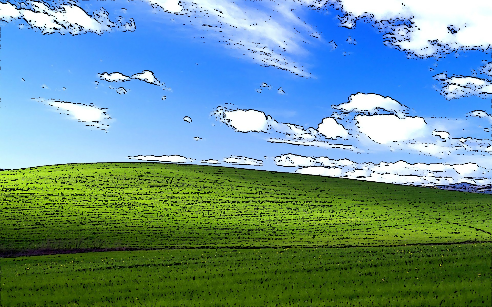
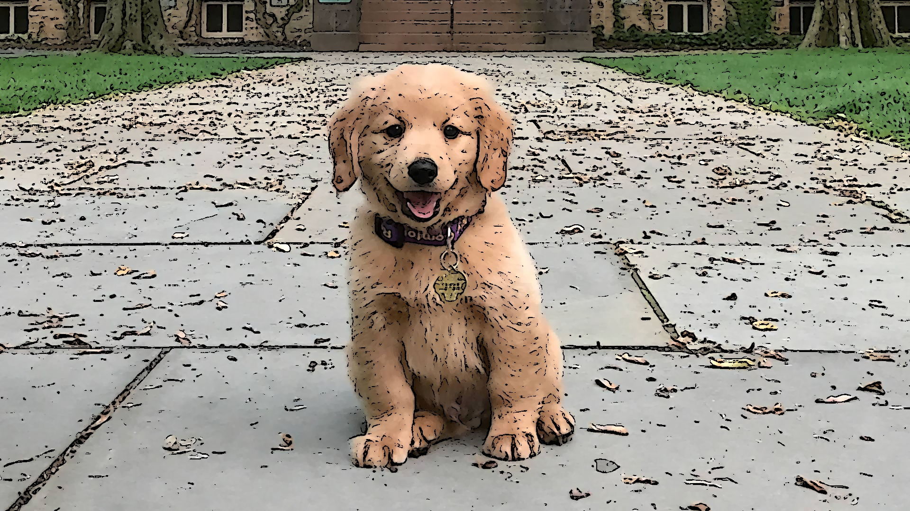

# Cartoon Converter
원하는 사진 or 영상을 카툰 그림체로 변환시켜주는 프로그램입니다.

### How To Use  
  
============   CARTOON COVERTER   ============  
=  Put your images in the data/image folder  =  
=  Put your videos in the data/video folder  =  
\=\=\=\=\=\=\=\=\=\=\=\=\=\=\=\=\=\=\=\=\=\=\=\=\=\=\=\=\=\=\=\=\=\=\=\=\=\=\=\=\=\=  
\>-- DETECTED IMAGES --<
1. dog.jpg
2. xp.jpg
3. cat.jpg   

\>-- DETECTED VIDEOS --<

4. kitten.mp4  

WHAT FILE DO YOU WANT TO CONVERT? : 

> * 변환하고 싶은 이미지는 data/image 폴더에, 비디오는 data/video에 넣으세요.  
> * app.py를 실행시킨 후 원하는 파일의 순번을 입력한 후 엔터를 치면 변환된 파일이 같은 디렉토리에 저장됩니다.  
> * 영상은 시간이 다소 걸릴 수 있습니다.

### Evaluation

`만화같은 느낌이 잘 표현되는 이미지`  
* 윈도우 xp의 배경화면입니다. 만화에 나오는 것처럼 그린 듯이 잘 표현된 모습을 볼 수 있습니다.  
원본 이미지  

변환 이미지  

`만화같은 느낌이 잘 표현되지 않는 이미지`
* 강아지 사진입니다. 강아지는 잘 표현되었으나, 뒤에 있는 낙엽들이 굉장히 비정상적으로 부각된 모습을 볼 수 있고, 이질감을 줍니다.
원본 이미지  

변환 이미지  

### Limit
본 프로그램의 알고리즘은 경계(edge)가 뚜렷하지 않은 이미지를 잘 변환해 줍니다. 그러나 경계가 뚜렷하고, 특히 경계가 많은 이미지는 경계를 너무 부각시켜서 이질감이 들게 합니다. 이러한 문제점이 보이는 이유는 다음과 같습니다. 
1. Laplacian 필터의 특성: Laplacian 필터는 이미지의 두 번째 도함수를 기반으로 하며, 이는 이미지의 경계에서 변화율이 급격히 바뀌는 지점을 강조하도록 설계되었습니다. 결과적으로, 경계가 더 선명하고 강조되게 나타납니다.

2. 이진화 처리: cv2.threshold 함수를 사용한 이진화 과정에서, 특정 임계값을 기준으로 픽셀 값을 검은색 또는 흰색으로 만듭니다. 이 과정에서 경계 부근의 픽셀이 검은색으로 강조되어, 카툰에서 보는 것처럼 경계가 더 두드러지게 표현됩니다.

3. 반복적인 bilateralFilter 적용: bilateralFilter는 이미지의 노이즈를 줄이면서도 에지를 보존하는 필터링 방법입니다. 하지만, 이 필터를 반복적으로 적용하면 내부 텍스처는 더욱 부드러워지는 반면, 이미 강조된 경계는 상대적으로 더 두드러지게 보일 수 있습니다.